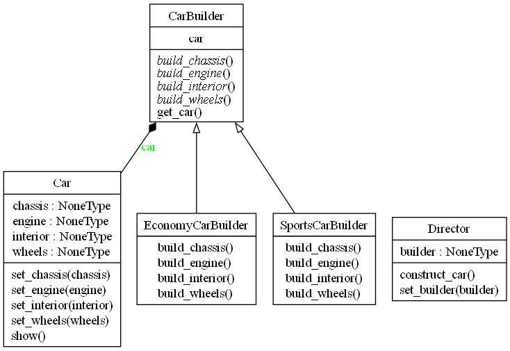

# Patrones de Diseño

## Factory Method

El patrón de diseño Factory Method es un patrón de diseño creacional que proporciona una interfaz para crear objetos en una superclase, pero permite que las subclases alteren el tipo de objetos que se crearán. Este patrón es útil cuando no se sabe de antemano el tipo exacto de objeto que se debe crear, y se desea delegar la responsabilidad de la creación de objetos a las subclases.

### Conceptos Clave:

1. Producto (Product): Define la interfaz de los objetos que el Factory Method crea.
2. Producto Concreto (ConcreteProduct): Implementa la interfaz del Producto. Estos son los objetos que serán creados por las subclases.
3. Creador (Creator): Declara el Factory Method, que devuelve un objeto del tipo Producto. Puede tener una implementación por defecto del Factory Method, que devuelve un producto básico.
4. Creador Concreto (ConcreteCreator): Sobrescribe el Factory Method para devolver una instancia de un Producto Concreto.

### Ejemplo

Supongamos que estamos desarrollando un sistema de gestión de documentos, y necesitamos crear diferentes tipos de documentos: PDF, Word y Excel. Usaremos el patrón Factory Method para crear estos documentos.

### Explicación:

1. Producto (Document): Define la interfaz de los documentos, que tiene dos métodos: open y save.
2. Producto Concreto (PDFDocument, WordDocument, ExcelDocument): Implementan la interfaz Document y proporcionan la funcionalidad específica para abrir y guardar los diferentes tipos de documentos.
3. Creador (Application): Declara el método create_document, que es abstracto y debe ser implementado por las subclases. También define un método new_document que utiliza el Factory Method para crear un documento y luego invoca los métodos open y save.
4. Creador Concreto (PDFApplication, WordApplication, ExcelApplication): Implementan el Factory Method para devolver una instancia específica de un documento.

## Abstract Factory

El patrón de diseño Abstract Factory es un patrón de diseño creacional que proporciona una interfaz para crear familias de objetos relacionados o dependientes sin especificar sus clases concretas. Este patrón es útil cuando un sistema debe ser independiente de cómo sus productos son creados, compuestos y representados, y cuando un sistema debe configurarse con una de varias familias de productos.

### Conceptos Clave:

1. AbstractFactory (Fábrica Abstracta): Declara una interfaz para crear productos abstractos relacionados o dependientes.
2. ConcreteFactory (Fábrica Concreta): Implementa la interfaz de la fábrica abstracta para crear instancias de productos concretos.
3. AbstractProduct (Producto Abstracto): Declara una interfaz para un tipo de producto.
4. ConcreteProduct (Producto Concreto): Implementa la interfaz del producto abstracto, definiendo un producto específico creado por la fábrica concreta correspondiente.
5. Client (Cliente): Utiliza únicamente las interfaces declaradas por las fábricas abstractas y los productos abstractos.

### Ejemplo

Imaginemos que estamos desarrollando una aplicación de interfaz de usuario que puede tener diferentes estilos de ventanas y botones, por ejemplo, estilo moderno y estilo clásico. Usaremos el patrón Abstract Factory para crear estos componentes.

### Explicación:

1. Productos Abstractos (Button, Window): Declaran las interfaces comunes para los botones y ventanas que se pueden crear.
2. Productos Concretos (ModernButton, ClassicButton, ModernWindow, ClassicWindow): Implementan las interfaces de los productos abstractos, representando estilos específicos (moderno y clásico) de botones y ventanas.
3. Fábrica Abstracta (GUIFactory): Define la interfaz para crear familias de productos relacionados, en este caso, botones y ventanas.
4. Fábricas Concretas (ModernGUIFactory, ClassicGUIFactory): Implementan la interfaz de la fábrica abstracta para crear productos concretos de una familia específica.
5. Cliente (Application): Utiliza la fábrica abstracta para crear y manejar objetos sin necesidad de conocer las clases concretas que serán instanciadas.

## Builder

El patrón de diseño Builder es un patrón creacional que se utiliza para construir un objeto complejo paso a paso. A diferencia de otros patrones de diseño creacionales, como Factory Method o Abstract Factory, el patrón Builder es especialmente útil cuando la creación de un objeto implica varios pasos, o cuando el proceso de construcción puede producir diferentes representaciones de un objeto.

### Conceptos Clave:

1. Builder: Define una interfaz para crear las partes de un objeto Producto.
2. ConcreteBuilder: Implementa la interfaz Builder y proporciona una implementación específica para construir las partes del Producto. Mantiene una instancia del Producto que va construyendo paso a paso.
3. Producto (Product): Representa el objeto complejo que está siendo construido. Generalmente, tiene una estructura interna compleja que requiere una configuración detallada.
4. Director: Dirige el proceso de construcción utilizando un Builder. Es opcional, pero puede ser útil para encapsular la construcción en un solo lugar.
5. Cliente (Client): Configura y utiliza el Director con un Builder específico para construir el objeto.

### Ejemplo

Imaginemos que estamos desarrollando un sistema para construir autos. Un auto tiene múltiples partes (como el motor, el chasis, las ruedas, etc.), y queremos crear autos personalizados utilizando diferentes configuraciones.

### Explicación:

1. Producto (Car): Es la clase que representa el objeto complejo que está siendo construido. En este caso, es un coche que tiene varias partes: motor, ruedas, chasis e interior.
2. Builder Abstracto (CarBuilder): Define la interfaz para construir las diferentes partes del producto. También mantiene una instancia del Producto que se está construyendo.
3. Concrete Builders (SportsCarBuilder, EconomyCarBuilder): Implementan la interfaz CarBuilder para construir una versión específica del coche. Cada ConcreteBuilder sabe cómo construir y ensamblar las partes de un coche de acuerdo a su tipo (deportivo o económico).
4. Director: La clase Director conoce la secuencia en la que deben construirse las partes del coche. El Director invoca los métodos del Builder para construir las diferentes partes del coche, pero no sabe nada sobre el coche en sí mismo.
5. Cliente (Client): El cliente crea un Builder concreto, lo configura en el Director y luego invoca la construcción. Finalmente, recupera el producto completo.