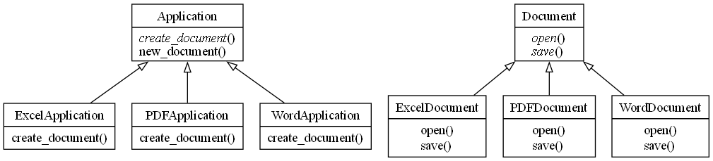
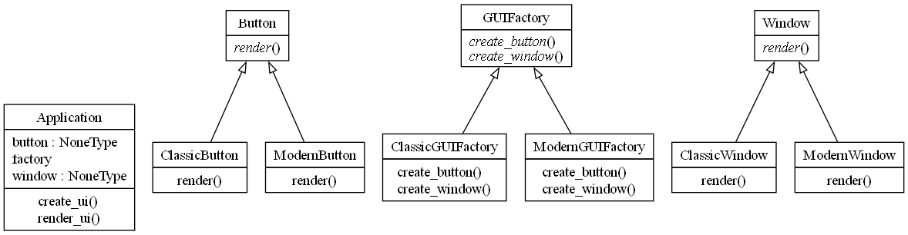

# Patrones de Diseño

## Factory Method

El patrón de diseño Factory Method es un patrón de diseño creacional que proporciona una interfaz para crear objetos en una superclase, pero permite que las subclases alteren el tipo de objetos que se crearán. Este patrón es útil cuando no se sabe de antemano el tipo exacto de objeto que se debe crear, y se desea delegar la responsabilidad de la creación de objetos a las subclases.

### Conceptos Clave:

1. Producto (Product): Define la interfaz de los objetos que el Factory Method crea.
2. Producto Concreto (ConcreteProduct): Implementa la interfaz del Producto. Estos son los objetos que serán creados por las subclases.
3. Creador (Creator): Declara el Factory Method, que devuelve un objeto del tipo Producto. Puede tener una implementación por defecto del Factory Method, que devuelve un producto básico.
4. Creador Concreto (ConcreteCreator): Sobrescribe el Factory Method para devolver una instancia de un Producto Concreto.

### Ejemplo

Supongamos que estamos desarrollando un sistema de gestión de documentos, y necesitamos crear diferentes tipos de documentos: PDF, Word y Excel. Usaremos el patrón Factory Method para crear estos documentos.

### Explicación:

1. Producto (Document): Define la interfaz de los documentos, que tiene dos métodos: open y save.
2. Producto Concreto (PDFDocument, WordDocument, ExcelDocument): Implementan la interfaz Document y proporcionan la funcionalidad específica para abrir y guardar los diferentes tipos de documentos.
3. Creador (Application): Declara el método create_document, que es abstracto y debe ser implementado por las subclases. También define un método new_document que utiliza el Factory Method para crear un documento y luego invoca los métodos open y save.
4. Creador Concreto (PDFApplication, WordApplication, ExcelApplication): Implementan el Factory Method para devolver una instancia específica de un documento.

## Abstract Factory

El patrón de diseño Abstract Factory es un patrón de diseño creacional que proporciona una interfaz para crear familias de objetos relacionados o dependientes sin especificar sus clases concretas. Este patrón es útil cuando un sistema debe ser independiente de cómo sus productos son creados, compuestos y representados, y cuando un sistema debe configurarse con una de varias familias de productos.

### Conceptos Clave:

1. AbstractFactory (Fábrica Abstracta): Declara una interfaz para crear productos abstractos relacionados o dependientes.
2. ConcreteFactory (Fábrica Concreta): Implementa la interfaz de la fábrica abstracta para crear instancias de productos concretos.
3. AbstractProduct (Producto Abstracto): Declara una interfaz para un tipo de producto.
4. ConcreteProduct (Producto Concreto): Implementa la interfaz del producto abstracto, definiendo un producto específico creado por la fábrica concreta correspondiente.
5. Client (Cliente): Utiliza únicamente las interfaces declaradas por las fábricas abstractas y los productos abstractos.

### Ejemplo

Imaginemos que estamos desarrollando una aplicación de interfaz de usuario que puede tener diferentes estilos de ventanas y botones, por ejemplo, estilo moderno y estilo clásico. Usaremos el patrón Abstract Factory para crear estos componentes.

### Explicación:

1. Productos Abstractos (Button, Window): Declaran las interfaces comunes para los botones y ventanas que se pueden crear.
2. Productos Concretos (ModernButton, ClassicButton, ModernWindow, ClassicWindow): Implementan las interfaces de los productos abstractos, representando estilos específicos (moderno y clásico) de botones y ventanas.
3. Fábrica Abstracta (GUIFactory): Define la interfaz para crear familias de productos relacionados, en este caso, botones y ventanas.
4. Fábricas Concretas (ModernGUIFactory, ClassicGUIFactory): Implementan la interfaz de la fábrica abstracta para crear productos concretos de una familia específica.
5. Cliente (Application): Utiliza la fábrica abstracta para crear y manejar objetos sin necesidad de conocer las clases concretas que serán instanciadas.