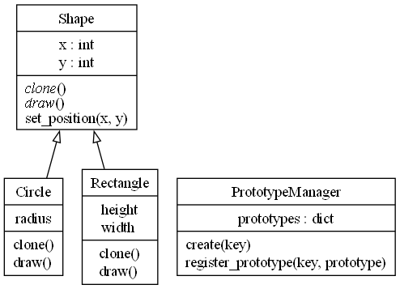
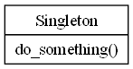

# Patrones Creacionales

## Factory Method

El patrón de diseño Factory Method es un patrón de diseño creacional que proporciona una interfaz para crear objetos en una superclase, pero permite que las subclases alteren el tipo de objetos que se crearán. Este patrón es útil cuando no se sabe de antemano el tipo exacto de objeto que se debe crear, y se desea delegar la responsabilidad de la creación de objetos a las subclases.

### Conceptos Clave:

1. Producto (Product): Define la interfaz de los objetos que el Factory Method crea.
2. Producto Concreto (ConcreteProduct): Implementa la interfaz del Producto. Estos son los objetos que serán creados por las subclases.
3. Creador (Creator): Declara el Factory Method, que devuelve un objeto del tipo Producto. Puede tener una implementación por defecto del Factory Method, que devuelve un producto básico.
4. Creador Concreto (ConcreteCreator): Sobrescribe el Factory Method para devolver una instancia de un Producto Concreto.

### Ejemplo

Supongamos que estamos desarrollando un sistema de gestión de documentos, y necesitamos crear diferentes tipos de documentos: PDF, Word y Excel. Usaremos el patrón Factory Method para crear estos documentos.

### Explicación:

1. Producto (Document): Define la interfaz de los documentos, que tiene dos métodos: open y save.
2. Producto Concreto (PDFDocument, WordDocument, ExcelDocument): Implementan la interfaz Document y proporcionan la funcionalidad específica para abrir y guardar los diferentes tipos de documentos.
3. Creador (Application): Declara el método create_document, que es abstracto y debe ser implementado por las subclases. También define un método new_document que utiliza el Factory Method para crear un documento y luego invoca los métodos open y save.
4. Creador Concreto (PDFApplication, WordApplication, ExcelApplication): Implementan el Factory Method para devolver una instancia específica de un documento.

### Conclusión

El patrón Factory Method es útil para desacoplar la creación de objetos del código que los utiliza. Esto permite mayor flexibilidad y facilidad para extender el sistema con nuevas clases de productos sin modificar el código existente que utiliza estos productos.

## Abstract Factory

El patrón de diseño Abstract Factory es un patrón de diseño creacional que proporciona una interfaz para crear familias de objetos relacionados o dependientes sin especificar sus clases concretas. Este patrón es útil cuando un sistema debe ser independiente de cómo sus productos son creados, compuestos y representados, y cuando un sistema debe configurarse con una de varias familias de productos.

### Conceptos Clave:

1. AbstractFactory (Fábrica Abstracta): Declara una interfaz para crear productos abstractos relacionados o dependientes.
2. ConcreteFactory (Fábrica Concreta): Implementa la interfaz de la fábrica abstracta para crear instancias de productos concretos.
3. AbstractProduct (Producto Abstracto): Declara una interfaz para un tipo de producto.
4. ConcreteProduct (Producto Concreto): Implementa la interfaz del producto abstracto, definiendo un producto específico creado por la fábrica concreta correspondiente.
5. Client (Cliente): Utiliza únicamente las interfaces declaradas por las fábricas abstractas y los productos abstractos.

### Ejemplo

Imaginemos que estamos desarrollando una aplicación de interfaz de usuario que puede tener diferentes estilos de ventanas y botones, por ejemplo, estilo moderno y estilo clásico. Usaremos el patrón Abstract Factory para crear estos componentes.

### Explicación:

1. Productos Abstractos (Button, Window): Declaran las interfaces comunes para los botones y ventanas que se pueden crear.
2. Productos Concretos (ModernButton, ClassicButton, ModernWindow, ClassicWindow): Implementan las interfaces de los productos abstractos, representando estilos específicos (moderno y clásico) de botones y ventanas.
3. Fábrica Abstracta (GUIFactory): Define la interfaz para crear familias de productos relacionados, en este caso, botones y ventanas.
4. Fábricas Concretas (ModernGUIFactory, ClassicGUIFactory): Implementan la interfaz de la fábrica abstracta para crear productos concretos de una familia específica.
5. Cliente (Application): Utiliza la fábrica abstracta para crear y manejar objetos sin necesidad de conocer las clases concretas que serán instanciadas.

### Conclusión

El patrón Abstract Factory es útil para crear familias de productos relacionados o dependientes. Esto asegura que los productos creados por una fábrica concreta sean compatibles entre sí, y facilita la intercambiabilidad de las familias de productos dentro de un sistema. Además, promueve el desacoplamiento del código del cliente respecto a las clases concretas de los productos que utiliza.

## Builder

El patrón de diseño Builder es un patrón creacional que se utiliza para construir un objeto complejo paso a paso. A diferencia de otros patrones de diseño creacionales, como Factory Method o Abstract Factory, el patrón Builder es especialmente útil cuando la creación de un objeto implica varios pasos, o cuando el proceso de construcción puede producir diferentes representaciones de un objeto.

### Conceptos Clave:

1. Builder: Define una interfaz para crear las partes de un objeto Producto.
2. ConcreteBuilder: Implementa la interfaz Builder y proporciona una implementación específica para construir las partes del Producto. Mantiene una instancia del Producto que va construyendo paso a paso.
3. Producto (Product): Representa el objeto complejo que está siendo construido. Generalmente, tiene una estructura interna compleja que requiere una configuración detallada.
4. Director: Dirige el proceso de construcción utilizando un Builder. Es opcional, pero puede ser útil para encapsular la construcción en un solo lugar.
5. Cliente (Client): Configura y utiliza el Director con un Builder específico para construir el objeto.

### Ejemplo

Imaginemos que estamos desarrollando un sistema para construir autos. Un auto tiene múltiples partes (como el motor, el chasis, las ruedas, etc.), y queremos crear autos personalizados utilizando diferentes configuraciones.

### Explicación:

1. Producto (Car): Es la clase que representa el objeto complejo que está siendo construido. En este caso, es un coche que tiene varias partes: motor, ruedas, chasis e interior.
2. Builder Abstracto (CarBuilder): Define la interfaz para construir las diferentes partes del producto. También mantiene una instancia del Producto que se está construyendo.
3. Concrete Builders (SportsCarBuilder, EconomyCarBuilder): Implementan la interfaz CarBuilder para construir una versión específica del coche. Cada ConcreteBuilder sabe cómo construir y ensamblar las partes de un coche de acuerdo a su tipo (deportivo o económico).
4. Director: La clase Director conoce la secuencia en la que deben construirse las partes del coche. El Director invoca los métodos del Builder para construir las diferentes partes del coche, pero no sabe nada sobre el coche en sí mismo.
5. Cliente (Client): El cliente crea un Builder concreto, lo configura en el Director y luego invoca la construcción. Finalmente, recupera el producto completo.

### Conclusión

El patrón Builder es particularmente útil cuando necesitas crear objetos que requieren un conjunto específico y secuencial de pasos para su construcción. Es un patrón flexible que permite separar la lógica de construcción de los detalles de implementación, lo que facilita la creación de variaciones del objeto sin necesidad de modificar el código existente. Además, permite la creación de objetos paso a paso, lo que puede ser útil en escenarios donde un objeto necesita ser construido en diferentes fases.

## Prototype

El patrón de diseño Prototype es un patrón creacional que permite crear nuevos objetos copiando o clonando una instancia existente, conocida como prototipo. Este patrón es útil cuando la creación de un objeto es costosa o compleja, o cuando quieres evitar la creación directa de objetos a través de la construcción (usando new en C++ o llamando a constructores en Python) y prefieres crear un nuevo objeto clonando uno existente.

### Conceptos Clave:

1. Prototype: Es una interfaz que declara el método de clonación (clone()). Este método se encargará de crear una copia del objeto.
2. ConcretePrototype: Implementa la interfaz Prototype y proporciona la lógica para clonar instancias de sí mismo. Es el objeto que se clonará.
3. Cliente (Client): Usa el método clone() del prototipo para crear nuevos objetos a partir de un prototipo existente sin necesidad de saber la clase concreta del objeto que está clonando.

### Ejemplo

Supongamos que estamos desarrollando un sistema para modelar figuras geométricas, donde algunas de estas figuras tienen características complejas y sería costoso crearlas desde cero. Usaremos el patrón Prototype para clonar figuras existentes y personalizarlas según sea necesario.

### Explicación:

1. Prototype (Shape): Es la interfaz abstracta que declara el método clone(). Esta interfaz también incluye métodos comunes que pueden ser utilizados por cualquier objeto Shape.
2. ConcretePrototype (Circle, Rectangle): Implementan la interfaz Shape y proporcionan la lógica específica para clonar su propia instancia (clone()). Estos son los objetos que se clonarán.
3. Cliente (PrototypeManager): El cliente gestiona y utiliza los prototipos. Registra los prototipos en un mapa o diccionario y permite la creación de nuevas instancias de objetos clonando los prototipos registrados.
4. Clonación: En C++, la clonación se realiza utilizando el método clone() que crea una copia profunda del objeto mediante la copia del estado del objeto original. En Python, se usa copy.deepcopy para crear una copia profunda del objeto, asegurando que cualquier objeto anidado también sea clonado correctamente.

### Conclusión

El patrón Prototype es útil en situaciones donde crear una nueva instancia de una clase puede ser costoso o complicado, y se desea evitar la repetición de lógica de creación para objetos similares. Al clonar un prototipo, se puede crear rápidamente un nuevo objeto con un estado predefinido, lo que mejora la eficiencia y la flexibilidad en el manejo de objetos complejos. Este patrón también es valioso cuando los objetos necesitan ser configurados dinámicamente en tiempo de ejecución.

## Singleton

El patrón de diseño Singleton es un patrón creacional que garantiza que una clase solo tenga una única instancia y proporciona un punto global de acceso a esa instancia. Este patrón es útil cuando es necesario que solo exista un objeto de una clase específica, ya que permite controlar el acceso a la instancia y asegura que todos los usuarios utilicen la misma instancia.

### Conceptos Clave:

1. Instancia Única: El patrón Singleton garantiza que solo una instancia de la clase sea creada durante la ejecución del programa. Si se intenta crear una nueva instancia, se devuelve la instancia ya existente.
2. Acceso Global: El patrón proporciona un punto de acceso global a la instancia única de la clase.
3. Control de la Creación: La clase Singleton controla cómo y cuándo se crea su instancia, generalmente implementando un método estático que maneja la creación de la instancia.

### Implementación en C++

En C++, la implementación de un Singleton debe manejar varios aspectos, como asegurar que no se puede crear más de una instancia, controlar la construcción y destrucción de la instancia, y garantizar la seguridad en contextos multihilo.

### Explicación:

1. Constructor Privado: El constructor de la clase es privado para evitar la creación directa de instancias fuera de la clase.
2. Método Estático getInstance(): Este método es responsable de crear y devolver la instancia única de la clase. Usa una variable estática local para garantizar que la instancia se crea solo una vez.
3. Delete de Métodos de Copia: Se eliminan los métodos de copia (constructor de copia y operador de asignación) para evitar que la instancia única sea duplicada.
4. Instancia Única: La instancia única es gestionada por el método getInstance(), que asegura que todos los accesos a la instancia se dirigen al mismo objeto.

### Implementación en Python

En Python, la implementación de un Singleton es un poco más sencilla debido a las características del lenguaje. Aquí hay varias maneras de implementarlo; una de las más comunes es usar métodos de clase para controlar la creación de la instancia.

### Explicación:

1. __new__ Método: En Python, __new__ es el método que controla la creación de nuevas instancias de la clase. En este caso, verifica si la instancia ya ha sido creada (_instance). Si no lo ha sido, crea una nueva instancia usando super().__new__(cls). Si ya existe una instancia, simplemente devuelve la existente.
2. _instance Atributo: _instance es un atributo de clase que mantiene la referencia a la instancia única del Singleton.
3. Acceso Global: El patrón Singleton permite que la instancia única sea accedida desde cualquier parte del código de manera global, asegurando que siempre se utilice la misma instancia.

### Consideraciones para Multithreading

En aplicaciones multihilo, es crucial asegurarse de que el Singleton sea seguro en cuanto a su creación, es decir, que no se creen múltiples instancias en hilos diferentes. Esto puede ser controlado usando mecanismos de sincronización como mutex en C++ o threading.Lock en Python.

### Conclusión

El patrón Singleton es útil para situaciones en las que solo se necesita una instancia de una clase, y se requiere un punto global de acceso. Sin embargo, debe usarse con cuidado, ya que puede introducir problemas si no se maneja adecuadamente en entornos multihilo, y también puede dificultar la escritura de pruebas unitarias debido a la dificultad para "resetear" el estado del Singleton entre pruebas. Es importante considerar estos factores y utilizar técnicas de diseño complementarias cuando sea necesario.